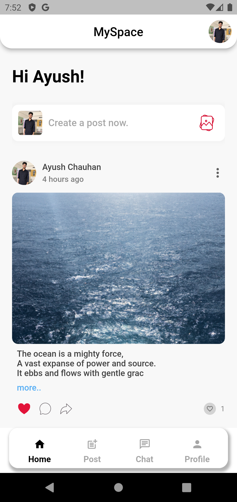
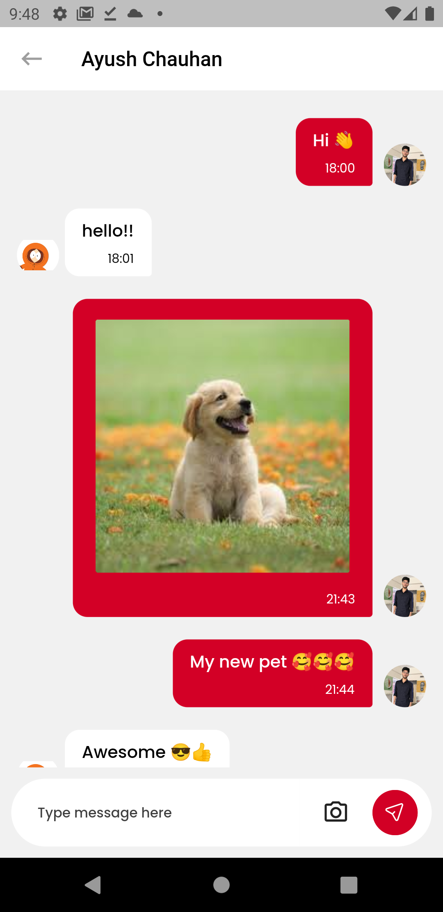
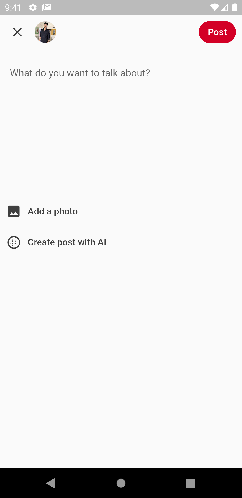
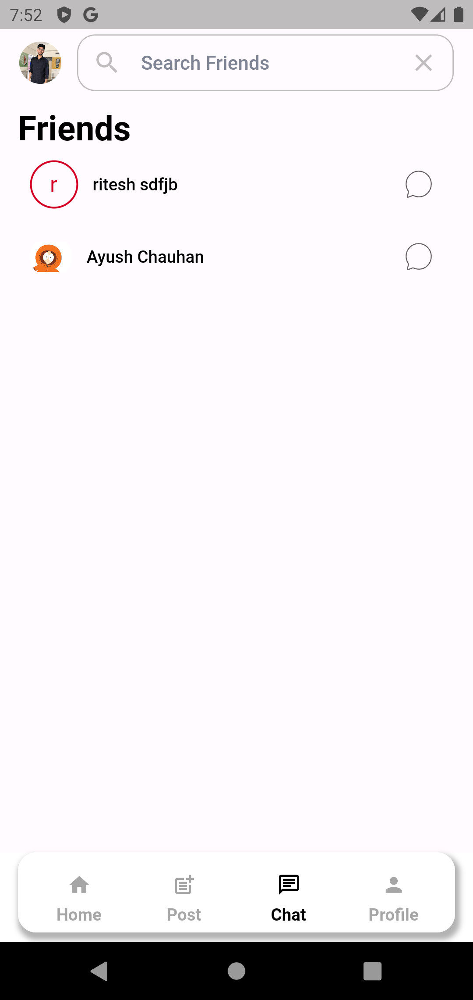

# MySpace

Made with Flutter❤️ 

MySpace is a social media app in which users can post content and can generate content with AI (chatGpt).
users can send a friend request and after accepting they can chat

  

  

## Features

. Post Content (Image & Text)
. AI-Generated Post
. Find Friend
. Chat
. Send Friend Request and Accept
. Notification of a friend request

## Backend

.Firebase

